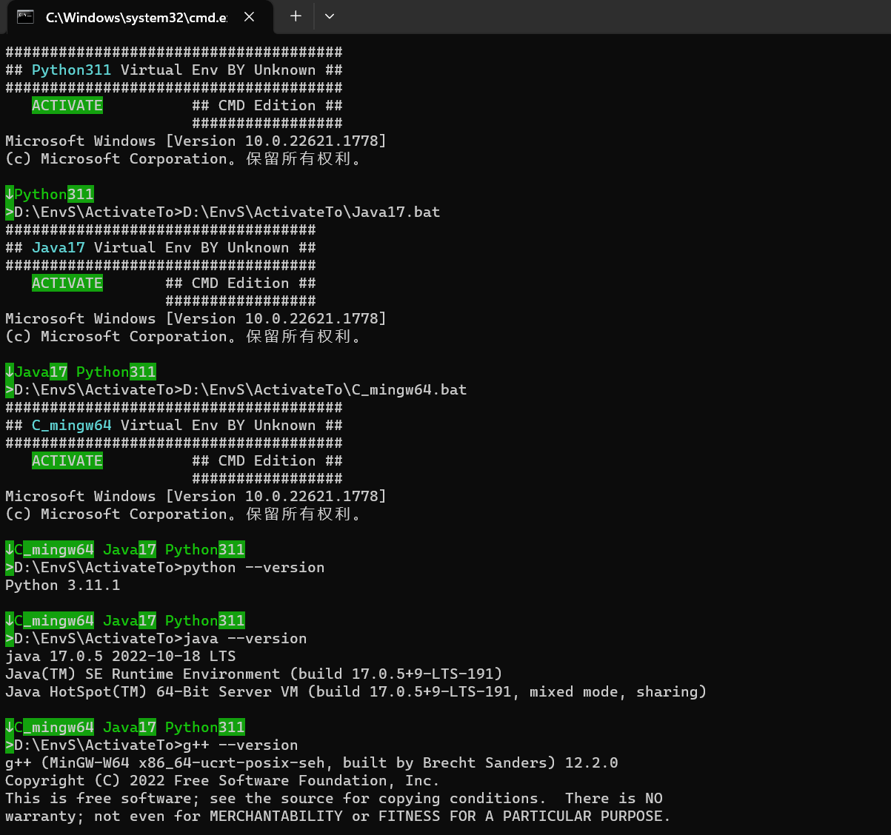
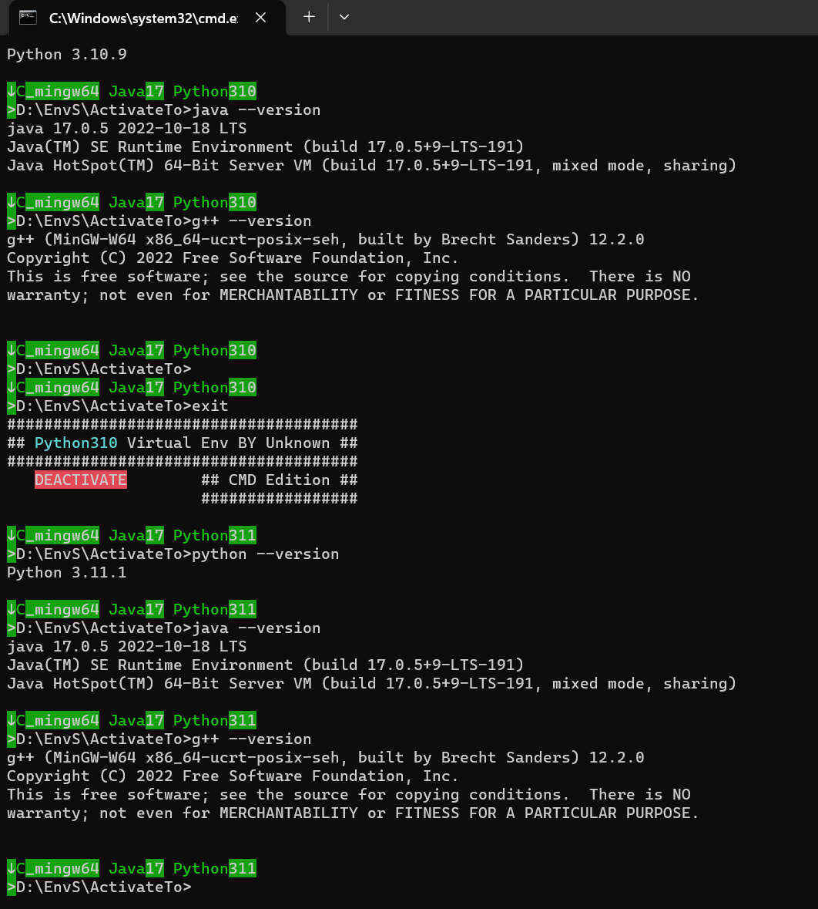
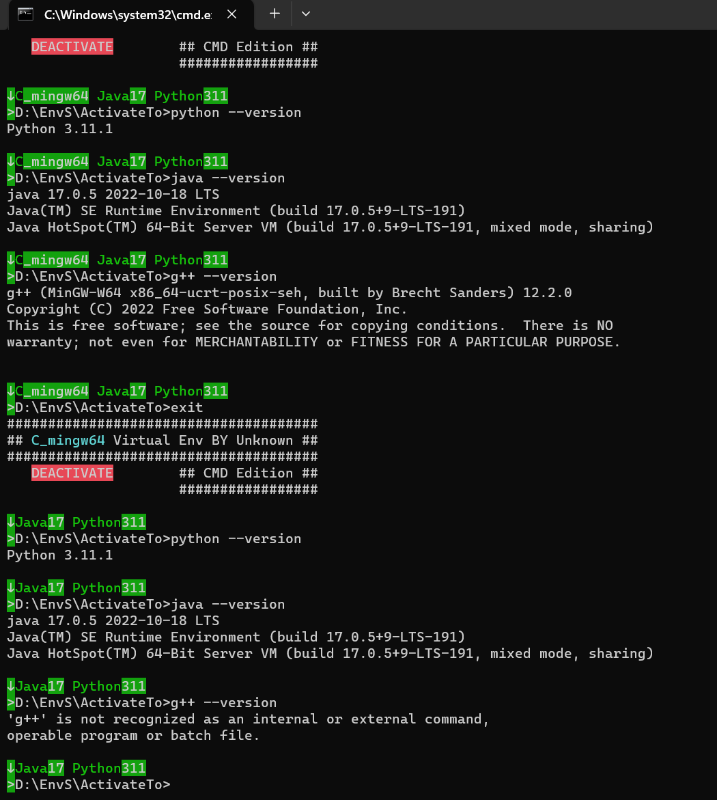

# EnvS(Environments for Windows)

## Introduction

In the process of developing under Windows, various open source projects use different combinations of development and operating environments. This environment collection aims to solve this problem.
When a software needs multiple operating environments and different versions, you can directly drag and drop the combined batch file to apply the environment, without installing the corresponding environment, configuring/changing environment variables, even if the development environments and versions of each software are diverse, Tools can be up and running in seconds.
At the same time, the environment version can be changed at any time. If the loaded environment is Python3.11, you can directly drag and drop the Python3.10 batch process to change the environment version. If you need to return to the original environment, just "*exit*" to exit the last loading environment of. (PS: The loading and replacement of the environment is in the first-in-last-out mode)
This collection also prefabricated the "activate" and "deactivate" batches for each environment, which is convenient for free writing of a dedicated operating environment for a certain software. You only need to "call" the "activate" batch of the environment in the final running batch. can be loaded. (PS: The loading and replacement of this environment is also the first-in-last-out mode)

## How to use it

### 1.Drag and drop for free combination

Open the batch processing of any environment, and drag other environments into it.

**· Quick composition of the operating environment:**



**· Quickly switch the operating environment:**


**· Quickly roll back the operating environment:**






### 2.Freely write dedicated runtime environment batch processing

```
:Start_Soft_001.cmd:
@echo off
call EnvS\Python\Python39\activate.bat
call EnvS\Java\java8\activate.bat
call EnvS\C\C_cmake3.25.1-x64\activate.bat
call cmd
```


## Environment directories and how they are named

Specific environment naming method: %environment name%%mainline version number%

Under the ActivateTo folder, the batch processing of the free combination environment is performed by quick drag and drop.

```
EnvS
├── ActivateTo
│   ├── Python310.bat
│   ├── Python311.bat
│   ├── Java8.bat
│   ├── Java17.bat
│   ├── C_cmake3.25.1-x64.bat
│   └── ......
├── C
│   ├── C_cmake3.25.1-x64
│   │   ├── activate.bat
│   │   ├── deactivate.bat
│   │   └── ......
│   ├── C_cmake3.25.1-x64
│   │   ├── activate.bat
│   │   ├── deactivate.bat
│   │   └── ......
│   └── ......
├── Java
│   ├── java8
│   │   ├── activate.bat
│   │   ├── deactivate.bat
│   │   └── ......
│   ├── java10
│   │   ├── activate.bat
│   │   ├── deactivate.bat
│   │   └── ......
│   └── ......
└── ......
```

## Environment set acquisition method

The source code of the project is only a batch process for switching environments, please check the latest Releases for those that include environment binary files.


Project Address: https://github.com/UnknownU0/EnvS
Releases: https://github.com/UnknownU0/EnvS/releases/tag/Latest
Baidu Netdisk: https://pan.baidu.com/s/13UlV1EtA2vFCw0HG6gJO_w?pwd=envs
Quark Cloud Drive: https://pan.quark.cn/s/c37b5dbb3d6a?pwd=5Fu3


**Have enjoy it!**

