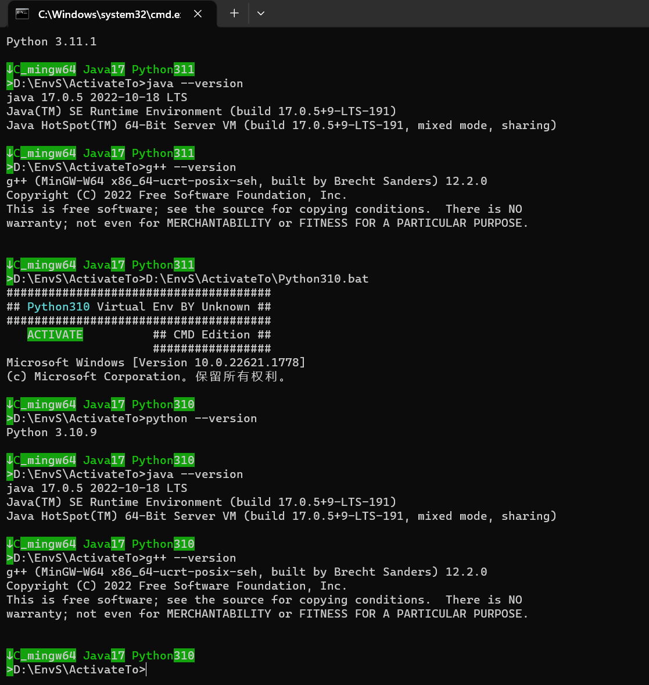
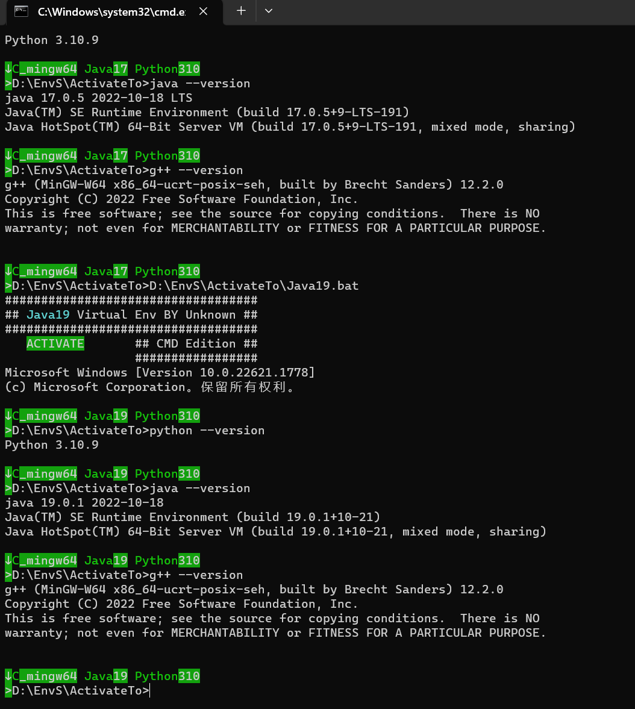
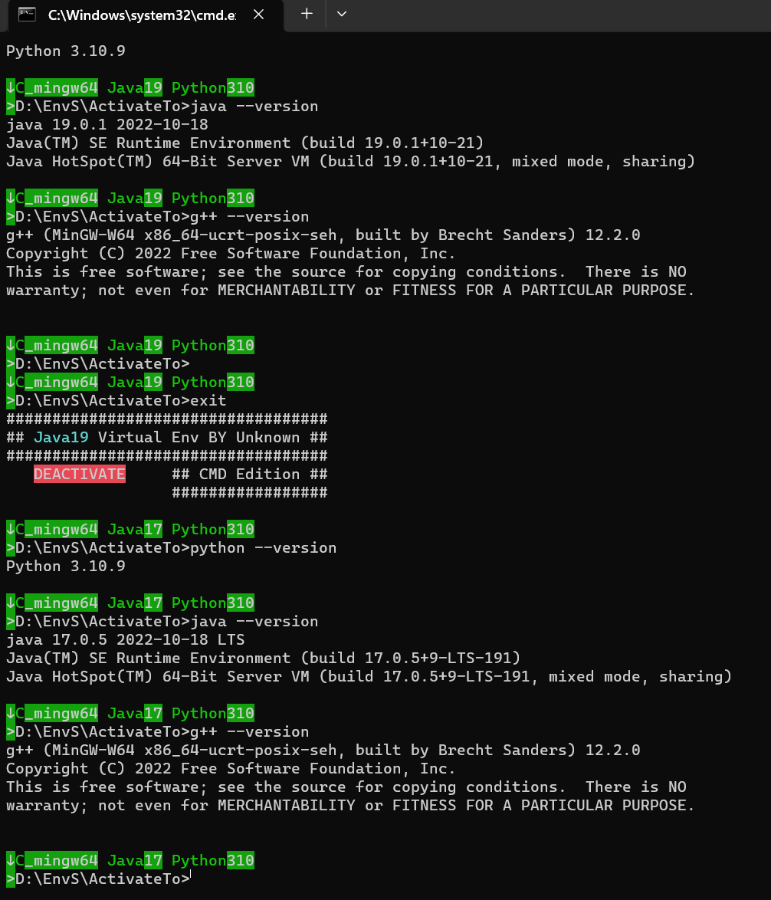
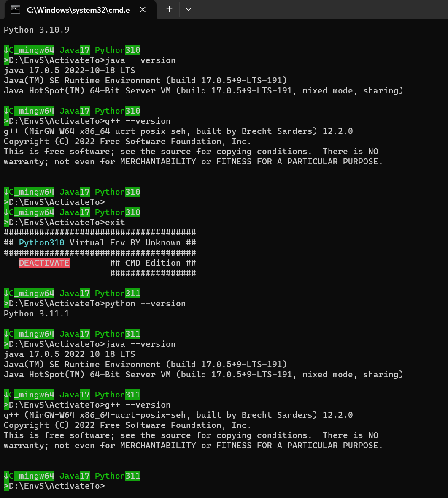
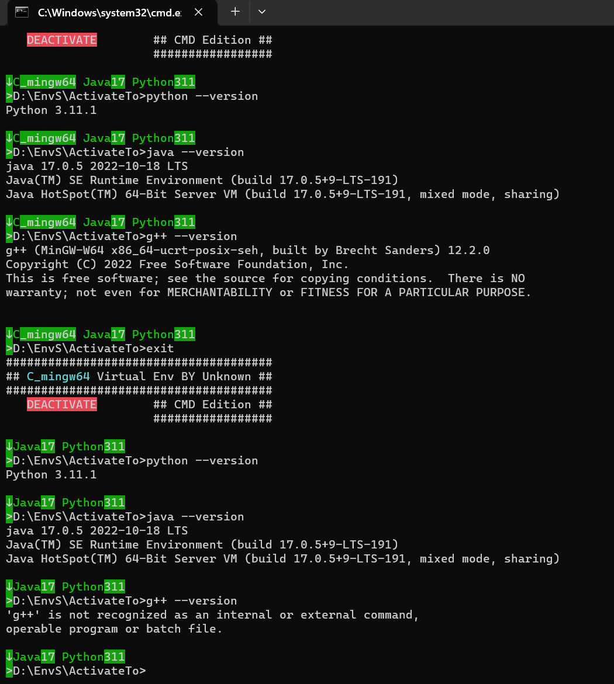
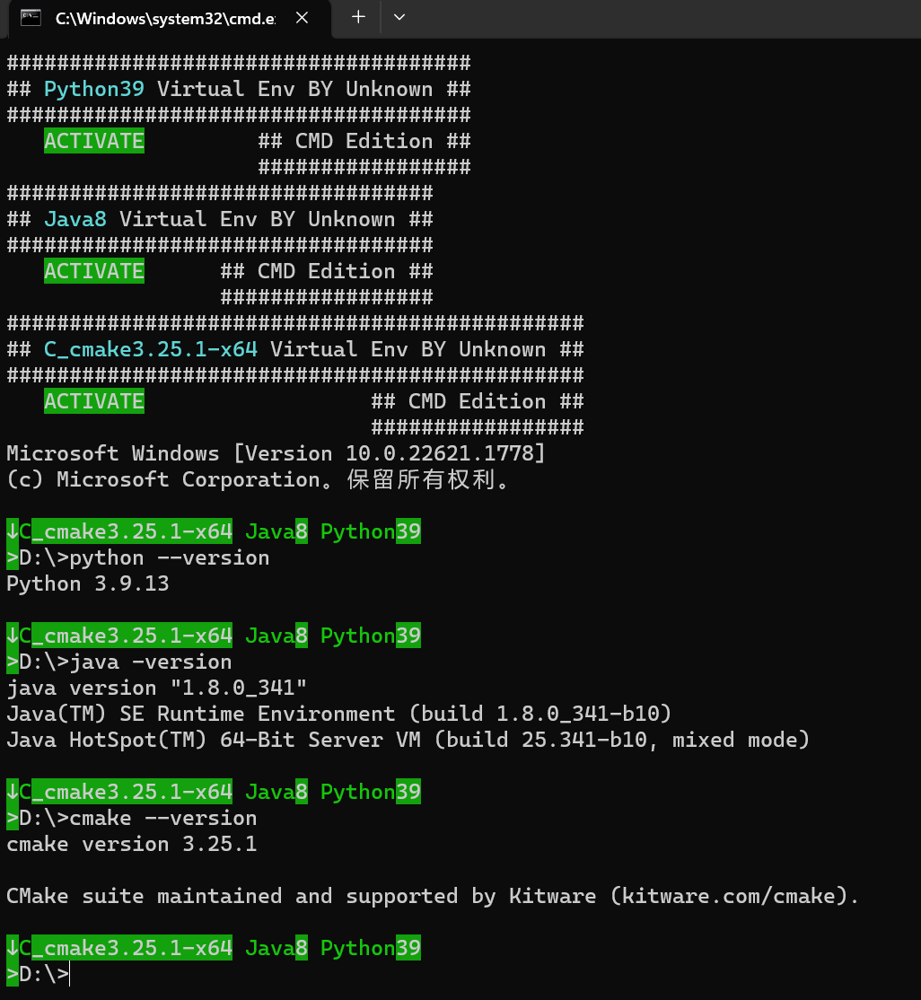

# EnvS(Environments for Windows)

## 简介

平时在Windows下开发的过程中各种开源项目使用不同的开发和运行环境组合，本环境集合旨在解决该问题。

在一个软件需要多种运行环境及不同版本时可直接拖拽组合批处理文件即可应用环境，不需要安装相应环境、配置/更改环境变量，即使各个软件的开发环境和版本多种多样，也可在顷刻之间将工具运行起来。

同时还可随时更换环境版本，如已经加载的环境为Python3.11，则可直接拖拽Python3.10批处理更换环境版本，如果需要退回原来的环境，只需“exit”即可退出最后一个加载的环境。（注：环境的加载与更换为先进后出的模式）

本集合还预制了每个环境的“activate”和“deactivate”批处理，方便自由编写某一软件的专用运行环境，只需要在最终运行批处理中”call“该环境的“activate”批处理即可加载。（注：这种环境的加载与更换同样为先进后出的模式）

## 使用方式

### 1.拖拽进行自由组合

打开任意一个环境的批处理，将其他的环境拖拽进来即可。

**· 快捷组成运行环境：**


**· 快捷切换运行环境：**





**· 快捷回退运行环境：**







### 2.自由编写专用运行环境批处理

```
:Start_Soft_001.cmd:
@echo off
call EnvS\Python\Python39\activate.bat
call EnvS\Java\java8\activate.bat
call EnvS\C\C_cmake3.25.1-x64\activate.bat
call cmd
```



## 环境目录及其命名方式

具体环境命名方式：%环境名称%%主线版本号%

ActivateTo文件夹下为快捷拖拽进行自由组合环境的批处理。

```
EnvS
├── ActivateTo
│   ├── Python310.bat
│   ├── Python311.bat
│   ├── Java8.bat
│   ├── Java17.bat
│   ├── C_cmake3.25.1-x64.bat
│   └── ......
├── C
│   ├── C_cmake3.25.1-x64
│   │   ├── activate.bat
│   │   ├── deactivate.bat
│   │   └── ......
│   ├── C_cmake3.25.1-x64
│   │   ├── activate.bat
│   │   ├── deactivate.bat
│   │   └── ......
│   └── ......
├── Java
│   ├── java8
│   │   ├── activate.bat
│   │   ├── deactivate.bat
│   │   └── ......
│   ├── java10
│   │   ├── activate.bat
│   │   ├── deactivate.bat
│   │   └── ......
│   └── ......
└── ......
```

## 环境集合获取方式

项目源码仅为用于切换环境的批处理，包含环境二进制文件的请查看最新的Releases。


项目地址：https://github.com/UnknownU0/EnvS
Releases：https://github.com/UnknownU0/EnvS/releases/tag/Latest
百度网盘：https://pan.baidu.com/s/13UlV1EtA2vFCw0HG6gJO_w?pwd=envs
夸克云盘：https://pan.quark.cn/s/c37b5dbb3d6a?pwd=5Fu3